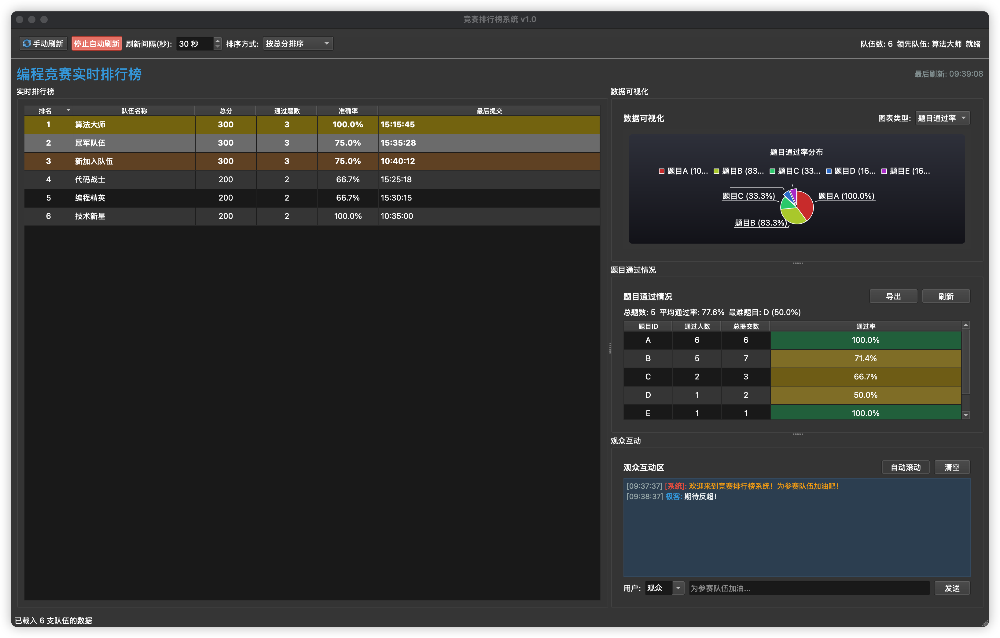
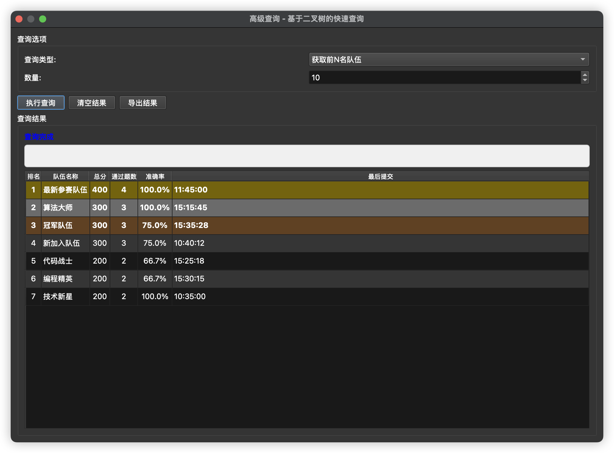

# Qt5/C++17 RankFlow

一个基于 Qt5 和 C++17 开发的实时排行榜系统，支持多队伍比赛监控、实时排名更新和弹幕显示功能。

## ✨ 功能特性

- 🏆 **实时排行榜**：动态更新队伍排名和成绩
- 📊 **数据可视化**：图表展示比赛进度和统计信息
- 💬 **弹幕显示**：增强观赛体验的互动功能
- 🔄 **自动监控**：实时监控数据文件变化
- 🎨 **现代界面**：基于 Qt5 的美观用户界面
- 🌐 **跨平台支持**：Windows、macOS、Linux 全平台兼容

 


## 🚀 快速开始

### 构建应用
```bash
# 快速构建（推荐）
./quick-build.sh

# 或使用完整构建脚本
./scripts/build/build.sh
```

### 运行应用
```bash
# 从构建目录运行
cd build
./RankingSystem

# 或从根目录运行
./build/RankingSystem
```

## 📁 项目结构

```
rank/
├── README.md                # 项目说明文档
├── LICENSE                  # 开源许可证
├── CMakeLists.txt          # CMake 构建配置
├── quick-build.sh          # 快速构建脚本
├── src/                    # 源代码目录
├── ui/                     # UI 界面文件
├── resources/              # 资源文件
├── data/                   # 测试数据
├── scripts/                # 脚本文件目录
│   ├── build/              # 构建脚本
│   ├── package/            # 打包脚本
│   ├── deploy/             # 部署脚本
│   └── tools/              # 工具脚本
└── doc/                    # 完整文档
    ├── user/               # 用户文档
    ├── technical/          # 技术文档
    ├── deployment/         # 部署文档
    └── troubleshooting/    # 故障排除
```

## 📚 文档导航

### 👥 用户文档
- [📖 用户手册](doc/user/user_manual.md) - 完整的用户操作指南
- [💾 安装指南](doc/user/install_guide.md) - 系统安装和配置
- [📥 数据导入指南](doc/user/data_import_guide.md) - 比赛数据导入说明
- [🎮 演示说明](doc/user/demo.md) - 功能演示和示例

### 🔧 技术文档
- [🏗️ 系统架构](doc/technical/architecture.md) - 详细的架构设计
- [📡 API 参考](doc/technical/api_reference.md) - 接口文档和规范
- [💻 开发指南](doc/technical/development_guide.md) - 开发环境和流程
- [📊 数据结构分析](doc/technical/data_structures.md) - 系统数据结构详解

### 🚀 部署文档
- [📦 部署指南](doc/deployment/deployment_guide.md) - 生产环境部署
- [📦 打包指南](doc/deployment/packaging_guide.md) - 应用打包说明
- [⚙️ 脚本说明](doc/deployment/scripts_guide.md) - 自动化脚本使用

### 🔍 故障排除
- [🍎 macOS 问题](doc/troubleshooting/macos_issues.md) - macOS 平台特有问题
- [💥 崩溃分析](doc/troubleshooting/crash_analysis.md) - 程序崩溃诊断
- [❓ 常见问题](doc/troubleshooting/common_issues.md) - FAQ 和解决方案

## 🛠️ 开发环境

### 系统要求
- **操作系统**：Windows 10+、macOS 10.14+、Ubuntu 18.04+
- **编译器**：支持 C++17 的现代编译器
- **Qt 版本**：Qt 5.12 或更高版本
- **CMake**：3.16 或更高版本

### 依赖库
- Qt5 Core、Widgets、Charts
- 标准 C++17 库
- CMake 构建系统

## 📦 脚本使用

本项目提供了完整的自动化脚本工具集：

### 构建脚本
```bash
./scripts/build/build.sh      # Linux/macOS 构建
scripts\build\build.bat       # Windows 构建
```

### 打包脚本
```bash
./scripts/package/package_linux.sh    # Linux 打包
./scripts/package/package_macos.sh    # macOS 打包
scripts\package\package_windows.bat   # Windows 打包
```

### 工具脚本
```bash
./scripts/tools/check_data.sh         # 数据检查
./scripts/tools/diagnose_crash.sh     # 崩溃诊断
./scripts/tools/fix_macos_app.sh      # macOS 修复
```

详细使用说明请查看 [脚本说明文档](scripts/README.md)。

## 📝 版本控制

项目使用 Git 进行版本控制，包含完整的 `.gitignore` 配置：

### 忽略文件管理
```bash
# 检查忽略状态
./scripts/tools/manage_gitignore.sh check

# 测试文件是否被忽略
./scripts/tools/manage_gitignore.sh test <文件路径>

# 清理被忽略的文件
./scripts/tools/manage_gitignore.sh clean
```

### 主要忽略内容
- 🔨 构建文件和目录 (`build/`, `*.o`, `*.exe`)
- 🔧 IDE 配置文件 (`.vscode/`, `.idea/`)
- 📦 打包文件 (`package/`, `dist/`, `*.dmg`)
- 📊 日志文件 (`logs/`, `*.log`)
- 🗂️ 系统文件 (`.DS_Store`, `Thumbs.db`)

详细使用说明请查看 [脚本说明文档](scripts/README.md)。

## 🤝 贡献指南

欢迎贡献代码！请遵循以下步骤：

1. Fork 本仓库
2. 创建特性分支 (`git checkout -b feature/AmazingFeature`)
3. 提交更改 (`git commit -m 'Add some AmazingFeature'`)
4. 推送到分支 (`git push origin feature/AmazingFeature`)
5. 打开 Pull Request

## 📄 许可证

本项目采用 MIT 许可证 - 详情请查看 [LICENSE](LICENSE) 文件。

## 📞 支持

如果您遇到问题或有疑问：

1. 📖 查看 [用户文档](doc/user/) 和 [故障排除](doc/troubleshooting/)
2. 🔍 搜索现有的 [Issues](../../issues)
3. 💬 创建新的 [Issue](../../issues/new) 描述您的问题
4. 📧 联系作者 [email](mailto://zuquanzhi@qq.com)

---

**最后更新时间**：2025年6月30日  
**当前版本**：v1.4.0
