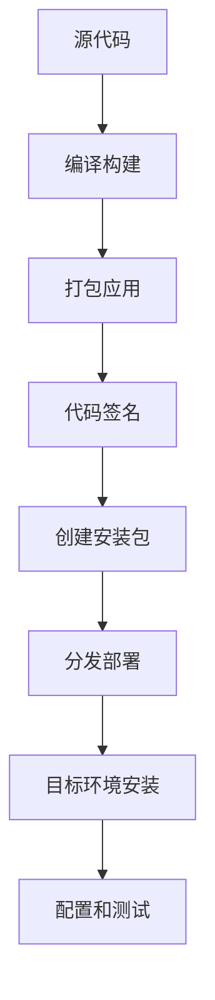

# RankingSystem 部署指南

## 概述

本指南详细说明如何将 RankingSystem 部署到生产环境中，包括各平台的打包、分发和安装步骤。

## 支持的平台

| 平台 | 格式 | 状态 | 备注 |
|------|------|------|------|
| Windows | .exe + MSI | ✅ 完全支持 | Windows 10+ |
| macOS | .app + DMG | ✅ 完全支持 | macOS 10.14+ |
| Linux | AppImage + .deb | ✅ 完全支持 | Ubuntu 18.04+ |

## 部署流程概览



## Windows 部署

### 环境准备

```powershell
# 安装必要工具
# 1. Visual Studio 2019+
# 2. Qt 5.15+ with MSVC
# 3. Windows SDK
# 4. NSIS (可选，用于创建安装包)
```

### 构建步骤

```powershell
# 1. 设置环境变量
$env:PATH += ";C:\Qt\5.15.2\msvc2019_64\bin"
$env:PATH += ";C:\Program Files (x86)\Microsoft Visual Studio\2019\Professional\VC\Tools\MSVC\14.29.30133\bin\Hostx64\x64"

# 2. 创建构建目录
mkdir build
cd build

# 3. 配置项目
cmake .. -G "Visual Studio 16 2019" -A x64 -DCMAKE_BUILD_TYPE=Release

# 4. 编译
cmake --build . --config Release

# 5. 运行Windows打包脚本
cd ..
.\package_windows.bat
```

### 打包输出

打包完成后将生成：
- `RankingSystem-v1.0-Windows.zip`：便携版
- `RankingSystem-v1.0-Setup.exe`：安装程序（如果配置了NSIS）

### 部署安装

```powershell
# 便携版部署
# 1. 解压zip文件到目标目录
# 2. 运行 RankingSystem.exe

# 安装程序部署
# 1. 运行 RankingSystem-v1.0-Setup.exe
# 2. 按照向导完成安装
# 3. 从开始菜单启动应用
```

## macOS 部署

### 环境准备

```bash
# 安装Xcode Command Line Tools
xcode-select --install

# 安装Qt
brew install qt@5

# 设置环境变量
export PATH="/usr/local/opt/qt@5/bin:$PATH"
```

### 构建步骤

```bash
# 1. 编译项目
mkdir build && cd build
cmake .. -DCMAKE_BUILD_TYPE=Release
make -j$(sysctl -n hw.ncpu)

# 2. 运行macOS打包脚本
cd ..
chmod +x package_macos_fixed.sh
./package_macos_fixed.sh
```

### 代码签名（可选）

```bash
# 如果有Apple开发者证书
codesign --force --deep --sign "Developer ID Application: Your Name" \
         --options runtime RankingSystem.app

# 公证（可选）
xcrun notarytool submit RankingSystem-v1.0-macOS.dmg \
                        --keychain-profile "notarytool-profile" \
                        --wait
```

### 打包输出

- `package/RankingSystem.app`：应用程序包
- `RankingSystem-v1.0-Fixed-macOS.dmg`：分发镜像

### 部署安装

```bash
# 1. 在目标Mac上打开DMG文件
# 2. 将RankingSystem.app拖拽到Applications文件夹
# 3. 首次运行时右键点击选择"打开"

# 如果遇到安全问题
sudo xattr -r -d com.apple.quarantine /Applications/RankingSystem.app
```

## Linux 部署

### 环境准备

```bash
# Ubuntu/Debian
sudo apt update
sudo apt install qt5-default qtbase5-dev qtchooser qt5-qmake qtbase5-dev-tools
sudo apt install libqt5charts5-dev
sudo apt install cmake build-essential

# CentOS/RHEL
sudo yum groupinstall "Development Tools"
sudo yum install qt5-qtbase-devel qt5-qtcharts-devel cmake
```

### 构建步骤

```bash
# 1. 编译项目
mkdir build && cd build
cmake .. -DCMAKE_BUILD_TYPE=Release
make -j$(nproc)

# 2. 运行Linux打包脚本
cd ..
chmod +x package_linux.sh
./package_linux.sh
```

### 创建AppImage（推荐）

```bash
# 下载linuxdeployqt
wget https://github.com/probonopd/linuxdeployqt/releases/download/continuous/linuxdeployqt-continuous-x86_64.AppImage
chmod +x linuxdeployqt-continuous-x86_64.AppImage

# 创建AppImage
./linuxdeployqt-continuous-x86_64.AppImage package-linux/RankingSystem/usr/share/applications/rankingsystem.desktop \
    -appimage -bundle-non-qt-libs
```

### 打包输出

- `RankingSystem-v1.0-Linux.tar.gz`：传统打包
- `RankingSystem-v1.0-x86_64.AppImage`：便携版应用

### 部署安装

```bash
# AppImage部署（推荐）
chmod +x RankingSystem-v1.0-x86_64.AppImage
./RankingSystem-v1.0-x86_64.AppImage

# 传统安装
tar -xzf RankingSystem-v1.0-Linux.tar.gz
cd RankingSystem
./install.sh
```

## 自动化部署

### CI/CD 配置

使用GitHub Actions进行自动构建：

```yaml
# .github/workflows/build.yml
name: Build and Package

on:
  push:
    tags:
      - 'v*'

jobs:
  build-windows:
    runs-on: windows-latest
    steps:
      - uses: actions/checkout@v3
      - name: Install Qt
        uses: jurplel/install-qt-action@v3
        with:
          version: '5.15.2'
          arch: 'win64_msvc2019_64'
      - name: Build
        run: |
          mkdir build && cd build
          cmake .. -G "Visual Studio 16 2019" -A x64
          cmake --build . --config Release
      - name: Package
        run: ./package_windows.bat
      - name: Upload artifacts
        uses: actions/upload-artifact@v3
        with:
          name: windows-package
          path: RankingSystem-*.zip

  build-macos:
    runs-on: macos-latest
    steps:
      - uses: actions/checkout@v3
      - name: Install Qt
        run: brew install qt@5
      - name: Build
        run: |
          export PATH="/usr/local/opt/qt@5/bin:$PATH"
          mkdir build && cd build
          cmake .. -DCMAKE_BUILD_TYPE=Release
          make -j$(sysctl -n hw.ncpu)
      - name: Package
        run: ./package_macos_fixed.sh
      - name: Upload artifacts
        uses: actions/upload-artifact@v3
        with:
          name: macos-package
          path: RankingSystem-*.dmg

  build-linux:
    runs-on: ubuntu-latest
    steps:
      - uses: actions/checkout@v3
      - name: Install dependencies
        run: |
          sudo apt update
          sudo apt install qt5-default libqt5charts5-dev cmake build-essential
      - name: Build
        run: |
          mkdir build && cd build
          cmake .. -DCMAKE_BUILD_TYPE=Release
          make -j$(nproc)
      - name: Package
        run: ./package_linux.sh
      - name: Upload artifacts
        uses: actions/upload-artifact@v3
        with:
          name: linux-package
          path: RankingSystem-*.tar.gz
```

### 发布脚本

```bash
#!/bin/bash
# scripts/release.sh

set -e

VERSION=${1:-"1.0.0"}
echo "Creating release for version $VERSION"

# 清理旧的构建
rm -rf build dist

# 为所有平台构建
echo "Building for all platforms..."

# Linux构建
echo "Building for Linux..."
mkdir build && cd build
cmake .. -DCMAKE_BUILD_TYPE=Release
make -j$(nproc)
cd ..
./package_linux.sh

# 如果在macOS上运行
if [[ "$OSTYPE" == "darwin"* ]]; then
    echo "Building for macOS..."
    ./package_macos_fixed.sh
fi

# 创建发布目录
mkdir -p dist/v$VERSION

# 移动打包文件
mv RankingSystem-*.* dist/v$VERSION/

echo "Release packages created in dist/v$VERSION/"
ls -la dist/v$VERSION/
```

## 配置管理

### 环境配置

创建环境特定的配置文件：

```json
// config/production.json
{
  "application": {
    "name": "RankingSystem",
    "version": "1.0.0",
    "mode": "production"
  },
  "data": {
    "autoRefresh": true,
    "refreshInterval": 300,
    "maxTeams": 100,
    "cacheEnabled": true
  },
  "ui": {
    "theme": "standard",
    "fullScreenMode": false,
    "showCharts": true,
    "showDanmaku": true
  },
  "logging": {
    "level": "warning",
    "fileLogging": true,
    "maxLogSize": "10MB"
  }
}
```

### 部署配置

```bash
#!/bin/bash
# scripts/configure_production.sh

# 复制生产配置
cp config/production.json data/config.json

# 设置权限
chmod 644 data/config.json
chmod 755 RankingSystem

# 创建日志目录
mkdir -p logs
chmod 755 logs

# 设置数据目录权限
chmod 755 data

echo "Production configuration applied"
```

## 监控和维护

### 健康检查

```bash
#!/bin/bash
# scripts/health_check.sh

APP_NAME="RankingSystem"
PID_FILE="/var/run/$APP_NAME.pid"

# 检查进程是否运行
if [ -f "$PID_FILE" ]; then
    PID=$(cat "$PID_FILE")
    if ps -p $PID > /dev/null; then
        echo "✅ $APP_NAME is running (PID: $PID)"
        exit 0
    else
        echo "❌ $APP_NAME is not running (stale PID file)"
        rm -f "$PID_FILE"
        exit 1
    fi
else
    echo "❌ $APP_NAME is not running (no PID file)"
    exit 1
fi
```

### 自动重启脚本

```bash
#!/bin/bash
# scripts/auto_restart.sh

APP_PATH="/opt/RankingSystem/RankingSystem"
LOG_FILE="/var/log/rankingsystem.log"

while true; do
    if ! ./health_check.sh; then
        echo "$(date): Restarting RankingSystem..." >> "$LOG_FILE"
        $APP_PATH >> "$LOG_FILE" 2>&1 &
        echo $! > /var/run/RankingSystem.pid
    fi
    sleep 60
done
```

### 日志管理

```bash
#!/bin/bash
# scripts/manage_logs.sh

LOG_DIR="/opt/RankingSystem/logs"
MAX_SIZE="100M"
MAX_AGE="30"

# 压缩旧日志
find "$LOG_DIR" -name "*.log" -size +$MAX_SIZE -exec gzip {} \;

# 删除过期日志
find "$LOG_DIR" -name "*.log.gz" -mtime +$MAX_AGE -delete

echo "Log maintenance completed"
```

## 故障排除

### 常见部署问题

1. **依赖库缺失**
   ```bash
   # Linux检查依赖
   ldd RankingSystem
   
   # macOS检查依赖
   otool -L RankingSystem.app/Contents/MacOS/RankingSystem
   
   # Windows检查依赖
   dumpbin /dependents RankingSystem.exe
   ```

2. **权限问题**
   ```bash
   # 设置正确权限
   chmod +x RankingSystem
   chown user:group RankingSystem
   ```

3. **配置文件错误**
   ```bash
   # 验证JSON配置
   python -m json.tool config.json
   
   # 或使用jq
   jq . config.json
   ```

### 性能调优

1. **内存优化**
   - 限制最大团队数量
   - 启用数据缓存
   - 定期清理日志

2. **CPU优化**
   - 调整刷新间隔
   - 禁用不必要的动画
   - 优化图表渲染

### 安全考虑

1. **文件权限**
   ```bash
   # 设置安全权限
   chmod 755 RankingSystem
   chmod 644 config.json
   chmod 600 logs/*.log
   ```

2. **网络安全**
   - 限制网络访问
   - 使用HTTPS进行数据传输
   - 验证数据来源

## 最佳实践

### 部署检查清单

- [ ] 所有依赖库已安装
- [ ] 配置文件已正确设置
- [ ] 权限已正确配置
- [ ] 日志目录已创建
- [ ] 健康检查脚本已部署
- [ ] 监控已配置
- [ ] 备份计划已制定

### 版本管理

1. **语义化版本**：使用 MAJOR.MINOR.PATCH 格式
2. **发布说明**：记录每个版本的变更
3. **向后兼容**：保证配置文件的向后兼容性

### 文档维护

- 保持部署文档更新
- 记录配置变更
- 维护故障排除知识库

---

**部署指南版本：** v1.0  
**适用项目版本：** RankingSystem v1.0+  
**最后更新：** 2025年6月30日  
**维护团队：** 运维组
