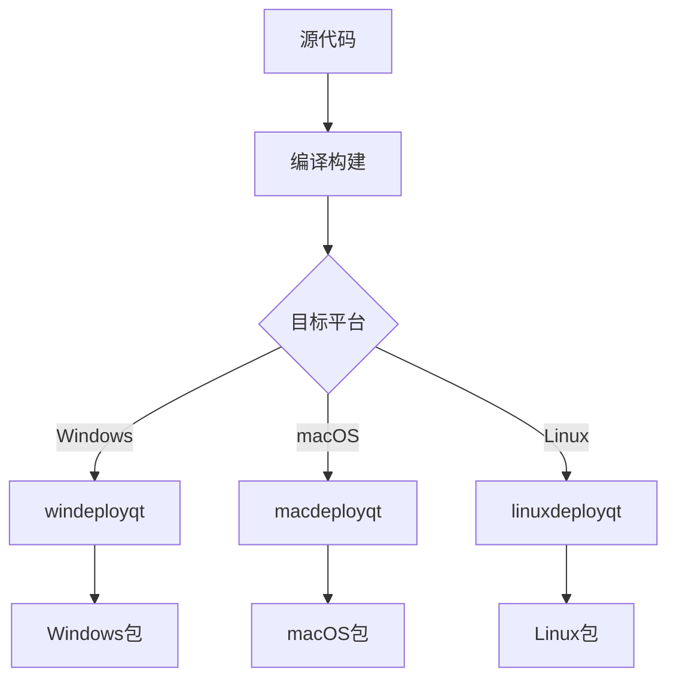

# RankingSystem 打包指南

## 概述

本指南说明如何为不同平台创建 RankingSystem 的分发包，包括依赖处理、资源打包和安装包生成。

## 跨平台打包概览



## Windows 打包

### 环境准备

```powershell
# 确保以下工具已安装
# 1. Qt 5.15+ (含 windeployqt)
# 2. Visual Studio 2019+
# 3. NSIS (可选，用于安装程序)
```

### 自动打包脚本

创建 `package_windows.bat`：

```batch
@echo off
echo Starting Windows packaging...

REM 设置变量
set QT_DIR=C:\Qt\5.15.2\msvc2019_64
set BUILD_DIR=build
set PACKAGE_DIR=package-windows
set APP_NAME=RankingSystem

REM 清理旧包
if exist %PACKAGE_DIR% rmdir /s /q %PACKAGE_DIR%
mkdir %PACKAGE_DIR%

REM 复制主程序
copy %BUILD_DIR%\bin\Release\%APP_NAME%.exe %PACKAGE_DIR%\

REM 使用 windeployqt 处理依赖
%QT_DIR%\bin\windeployqt.exe --release --qmldir . %PACKAGE_DIR%\%APP_NAME%.exe

REM 复制资源文件
xcopy /E /I data %PACKAGE_DIR%\data\
xcopy /E /I resources %PACKAGE_DIR%\resources\

REM 复制文档
mkdir %PACKAGE_DIR%\docs
copy doc\user\*.md %PACKAGE_DIR%\docs\
copy README.md %PACKAGE_DIR%\
copy LICENSE %PACKAGE_DIR%\

REM 创建启动脚本
echo @echo off > %PACKAGE_DIR%\start.bat
echo cd /d "%%~dp0" >> %PACKAGE_DIR%\start.bat
echo %APP_NAME%.exe >> %PACKAGE_DIR%\start.bat

REM 创建 ZIP 包
powershell -command "Compress-Archive -Path '%PACKAGE_DIR%\*' -DestinationPath 'RankingSystem-v1.0-Windows.zip' -Force"

echo Windows packaging completed!
echo Created: RankingSystem-v1.0-Windows.zip
```

### 创建安装程序 (NSIS)

创建 `installer.nsi`：

```nsis
; RankingSystem Windows Installer
!define APP_NAME "RankingSystem"
!define APP_VERSION "1.0.0"
!define PUBLISHER "YourCompany"
!define WEB_SITE "https://your-website.com"
!define APP_EXE "RankingSystem.exe"

!include "MUI2.nsh"

Name "${APP_NAME} ${APP_VERSION}"
OutFile "RankingSystem-v1.0-Setup.exe"
InstallDir "$PROGRAMFILES\${APP_NAME}"

; 界面设置
!define MUI_ABORTWARNING
!define MUI_ICON "resources\icon.ico"
!define MUI_UNICON "resources\icon.ico"

; 页面
!insertmacro MUI_PAGE_WELCOME
!insertmacro MUI_PAGE_LICENSE "LICENSE"
!insertmacro MUI_PAGE_DIRECTORY
!insertmacro MUI_PAGE_INSTFILES
!insertmacro MUI_PAGE_FINISH

!insertmacro MUI_UNPAGE_CONFIRM
!insertmacro MUI_UNPAGE_INSTFILES

; 语言
!insertmacro MUI_LANGUAGE "English"
!insertmacro MUI_LANGUAGE "SimpChinese"

; 安装部分
Section "MainSection" SEC01
    SetOutPath "$INSTDIR"
    SetOverwrite ifnewer
    
    ; 复制所有文件
    File /r "package-windows\*"
    
    ; 创建开始菜单快捷方式
    CreateDirectory "$SMPROGRAMS\${APP_NAME}"
    CreateShortCut "$SMPROGRAMS\${APP_NAME}\${APP_NAME}.lnk" "$INSTDIR\${APP_EXE}"
    CreateShortCut "$SMPROGRAMS\${APP_NAME}\Uninstall.lnk" "$INSTDIR\uninst.exe"
    
    ; 创建桌面快捷方式
    CreateShortCut "$DESKTOP\${APP_NAME}.lnk" "$INSTDIR\${APP_EXE}"
    
    ; 写入卸载信息
    WriteRegStr HKLM "Software\Microsoft\Windows\CurrentVersion\Uninstall\${APP_NAME}" "DisplayName" "${APP_NAME}"
    WriteRegStr HKLM "Software\Microsoft\Windows\CurrentVersion\Uninstall\${APP_NAME}" "UninstallString" "$INSTDIR\uninst.exe"
    WriteUninstaller "$INSTDIR\uninst.exe"
SectionEnd

; 卸载部分
Section Uninstall
    Delete "$INSTDIR\uninst.exe"
    RMDir /r "$INSTDIR"
    
    Delete "$SMPROGRAMS\${APP_NAME}\*.*"
    RMDir "$SMPROGRAMS\${APP_NAME}"
    Delete "$DESKTOP\${APP_NAME}.lnk"
    
    DeleteRegKey HKLM "Software\Microsoft\Windows\CurrentVersion\Uninstall\${APP_NAME}"
SectionEnd
```

## macOS 打包

### 自动打包脚本

完善的 `package_macos.sh`：

```bash
#!/bin/bash
set -e

# 配置变量
APP_NAME="RankingSystem"
VERSION="1.0"
BUILD_DIR="build"
PACKAGE_DIR="package"
APP_BUNDLE="$PACKAGE_DIR/$APP_NAME.app"

echo "Starting macOS packaging for $APP_NAME v$VERSION..."

# 清理旧包
rm -rf "$PACKAGE_DIR"
mkdir -p "$PACKAGE_DIR"

# 创建 .app 目录结构
mkdir -p "$APP_BUNDLE/Contents/"{MacOS,Resources,Frameworks}

# 复制主程序
cp "$BUILD_DIR/bin/$APP_NAME" "$APP_BUNDLE/Contents/MacOS/"

# 创建 Info.plist
cat > "$APP_BUNDLE/Contents/Info.plist" << EOF
<?xml version="1.0" encoding="UTF-8"?>
<!DOCTYPE plist PUBLIC "-//Apple//DTD PLIST 1.0//EN" "http://www.apple.com/DTDs/PropertyList-1.0.dtd">
<plist version="1.0">
<dict>
    <key>CFBundleExecutable</key>
    <string>$APP_NAME</string>
    <key>CFBundleIdentifier</key>
    <string>com.company.$APP_NAME</string>
    <key>CFBundleName</key>
    <string>$APP_NAME</string>
    <key>CFBundleVersion</key>
    <string>$VERSION</string>
    <key>CFBundleShortVersionString</key>
    <string>$VERSION</string>
    <key>CFBundleInfoDictionaryVersion</key>
    <string>6.0</string>
    <key>CFBundlePackageType</key>
    <string>APPL</string>
    <key>CFBundleSignature</key>
    <string>????</string>
    <key>LSMinimumSystemVersion</key>
    <string>10.14</string>
    <key>NSHighResolutionCapable</key>
    <true/>
    <key>NSSupportsAutomaticGraphicsSwitching</key>
    <true/>
</dict>
</plist>
EOF

# 使用 macdeployqt 处理依赖
echo "Processing Qt dependencies..."
QT_DIR=$(brew --prefix qt@5 2>/dev/null || echo "/usr/local/opt/qt@5")
"$QT_DIR/bin/macdeployqt" "$APP_BUNDLE" -verbose=2

# 复制资源文件
echo "Copying resources..."
cp -r data "$APP_BUNDLE/Contents/MacOS/"
cp -r resources "$APP_BUNDLE/Contents/Resources/" 2>/dev/null || true

# 复制文档
mkdir -p "$APP_BUNDLE/Contents/MacOS/docs"
cp doc/user/*.md "$APP_BUNDLE/Contents/MacOS/docs/" 2>/dev/null || true
cp README.md "$APP_BUNDLE/Contents/MacOS/" 2>/dev/null || true
cp LICENSE "$APP_BUNDLE/Contents/MacOS/" 2>/dev/null || true

# 代码签名 (adhoc)
echo "Signing application..."
codesign --force --deep --sign - "$APP_BUNDLE"

# 创建 DMG
echo "Creating DMG..."
DMG_NAME="$APP_NAME-v$VERSION-macOS.dmg"
rm -f "$DMG_NAME"

# 创建临时 DMG
hdiutil create -srcfolder "$PACKAGE_DIR" -volname "$APP_NAME" -ov -format UDZO "$DMG_NAME"

echo "✅ macOS packaging completed!"
echo "Created: $DMG_NAME"
echo "App bundle: $APP_BUNDLE"
```

### 高级 DMG 创建

创建带背景图的定制 DMG：

```bash
#!/bin/bash
# create_dmg_advanced.sh

APP_NAME="RankingSystem"
VERSION="1.0"
SOURCE_DIR="package"
DMG_NAME="$APP_NAME-v$VERSION-macOS.dmg"
DMG_TEMP="temp_dmg"

# 创建临时 DMG 目录
rm -rf "$DMG_TEMP"
mkdir "$DMG_TEMP"

# 复制应用和创建 Applications 链接
cp -r "$SOURCE_DIR/$APP_NAME.app" "$DMG_TEMP/"
ln -s /Applications "$DMG_TEMP/Applications"

# 复制背景图片（如果有）
mkdir "$DMG_TEMP/.background"
cp "resources/dmg_background.png" "$DMG_TEMP/.background/" 2>/dev/null || true

# 创建 DMG
hdiutil create -srcfolder "$DMG_TEMP" -volname "$APP_NAME" -ov -format UDRW temp.dmg

# 挂载 DMG 进行定制
hdiutil attach temp.dmg

# 设置 DMG 外观（需要 AppleScript）
osascript << EOF
tell application "Finder"
    tell disk "$APP_NAME"
        open
        set current view of container window to icon view
        set toolbar visible of container window to false
        set statusbar visible of container window to false
        set the bounds of container window to {400, 100, 900, 450}
        set theViewOptions to the icon view options of container window
        set arrangement of theViewOptions to not arranged
        set icon size of theViewOptions to 72
        set position of item "$APP_NAME.app" of container window to {150, 200}
        set position of item "Applications" of container window to {350, 200}
        update without registering applications
        delay 2
        close
    end tell
end tell
EOF

# 卸载并压缩
hdiutil detach "/Volumes/$APP_NAME"
hdiutil convert temp.dmg -format UDZO -o "$DMG_NAME"
rm temp.dmg
rm -rf "$DMG_TEMP"

echo "Advanced DMG created: $DMG_NAME"
```

## Linux 打包

### AppImage 打包

创建 `package_linux.sh`：

```bash
#!/bin/bash
set -e

APP_NAME="RankingSystem"
VERSION="1.0"
BUILD_DIR="build"
PACKAGE_DIR="package-linux/$APP_NAME"

echo "Starting Linux packaging for $APP_NAME v$VERSION..."

# 清理旧包
rm -rf package-linux
mkdir -p "$PACKAGE_DIR/usr/"{bin,share/applications,share/icons/hicolor/256x256/apps,share/$APP_NAME}

# 复制主程序
cp "$BUILD_DIR/bin/$APP_NAME" "$PACKAGE_DIR/usr/bin/"

# 复制资源
cp -r data "$PACKAGE_DIR/usr/share/$APP_NAME/"
cp -r resources "$PACKAGE_DIR/usr/share/$APP_NAME/" 2>/dev/null || true

# 创建桌面文件
cat > "$PACKAGE_DIR/usr/share/applications/rankingsystem.desktop" << EOF
[Desktop Entry]
Type=Application
Name=RankingSystem
Comment=Competition Ranking System
Exec=RankingSystem
Icon=rankingsystem
Categories=Office;Education;
Terminal=false
StartupWMClass=RankingSystem
EOF

# 复制图标
cp "resources/icon.png" "$PACKAGE_DIR/usr/share/icons/hicolor/256x256/apps/rankingsystem.png" 2>/dev/null || true

# 创建 AppRun 脚本
cat > "$PACKAGE_DIR/AppRun" << 'EOF'
#!/bin/bash
SELF=$(readlink -f "$0")
HERE=${SELF%/*}
export PATH="${HERE}/usr/bin/:${PATH}"
export LD_LIBRARY_PATH="${HERE}/usr/lib/:${LD_LIBRARY_PATH}"
export XDG_DATA_DIRS="${HERE}/usr/share/:${XDG_DATA_DIRS}"
cd "${HERE}/usr/share/RankingSystem"
exec "${HERE}/usr/bin/RankingSystem" "$@"
EOF

chmod +x "$PACKAGE_DIR/AppRun"

# 复制桌面文件到根目录
cp "$PACKAGE_DIR/usr/share/applications/rankingsystem.desktop" "$PACKAGE_DIR/"

# 复制图标到根目录
cp "$PACKAGE_DIR/usr/share/icons/hicolor/256x256/apps/rankingsystem.png" "$PACKAGE_DIR/" 2>/dev/null || true

# 下载 linuxdeployqt（如果不存在）
if [ ! -f "linuxdeployqt.AppImage" ]; then
    echo "Downloading linuxdeployqt..."
    wget -q https://github.com/probonopd/linuxdeployqt/releases/download/continuous/linuxdeployqt-continuous-x86_64.AppImage -O linuxdeployqt.AppImage
    chmod +x linuxdeployqt.AppImage
fi

# 使用 linuxdeployqt 处理依赖
echo "Processing dependencies..."
./linuxdeployqt.AppImage "$PACKAGE_DIR/usr/share/applications/rankingsystem.desktop" -bundle-non-qt-libs

# 创建传统打包
echo "Creating tar.gz package..."
cd package-linux
tar -czf "../$APP_NAME-v$VERSION-Linux.tar.gz" "$APP_NAME/"
cd ..

echo "✅ Linux packaging completed!"
echo "Created: $APP_NAME-v$VERSION-Linux.tar.gz"
```

### 创建 DEB 包

```bash
#!/bin/bash
# create_deb.sh

APP_NAME="rankingsystem"
VERSION="1.0.0"
ARCH="amd64"
DEB_DIR="deb_package"

# 创建 DEB 目录结构
mkdir -p "$DEB_DIR/DEBIAN"
mkdir -p "$DEB_DIR/usr/bin"
mkdir -p "$DEB_DIR/usr/share/applications"
mkdir -p "$DEB_DIR/usr/share/$APP_NAME"
mkdir -p "$DEB_DIR/usr/share/icons/hicolor/256x256/apps"

# 复制文件
cp "build/bin/RankingSystem" "$DEB_DIR/usr/bin/rankingsystem"
cp -r data "$DEB_DIR/usr/share/$APP_NAME/"
cp "package-linux/RankingSystem/usr/share/applications/rankingsystem.desktop" "$DEB_DIR/usr/share/applications/"
cp "resources/icon.png" "$DEB_DIR/usr/share/icons/hicolor/256x256/apps/rankingsystem.png" 2>/dev/null || true

# 创建 control 文件
cat > "$DEB_DIR/DEBIAN/control" << EOF
Package: $APP_NAME
Version: $VERSION
Section: education
Priority: optional
Architecture: $ARCH
Depends: qt5-default, libqt5charts5
Maintainer: Your Name <your.email@example.com>
Description: Competition Ranking System
 A real-time ranking system for programming competitions
 with data visualization and interactive features.
EOF

# 创建 postinst 脚本
cat > "$DEB_DIR/DEBIAN/postinst" << EOF
#!/bin/bash
update-desktop-database
update-icon-caches /usr/share/icons/hicolor
EOF

chmod +x "$DEB_DIR/DEBIAN/postinst"

# 构建 DEB 包
dpkg-deb --build "$DEB_DIR" "${APP_NAME}_${VERSION}_${ARCH}.deb"

echo "DEB package created: ${APP_NAME}_${VERSION}_${ARCH}.deb"
```

## 通用打包工具

### 跨平台构建脚本

创建 `package_all.sh`：

```bash
#!/bin/bash
# package_all.sh - 跨平台打包脚本

set -e

APP_NAME="RankingSystem"
VERSION="1.0.0"

echo "🚀 Starting cross-platform packaging for $APP_NAME v$VERSION"

# 检测当前平台
case "$(uname -s)" in
    Darwin*)
        echo "📱 Detected macOS - Creating macOS package"
        ./package_macos_fixed.sh
        ;;
    Linux*)
        echo "🐧 Detected Linux - Creating Linux packages"
        ./package_linux.sh
        ;;
    CYGWIN*|MINGW32*|MSYS*|MINGW*)
        echo "🪟 Detected Windows - Creating Windows package"
        ./package_windows.bat
        ;;
    *)
        echo "❌ Unknown platform: $(uname -s)"
        exit 1
        ;;
esac

# 创建通用文档包
echo "📚 Creating documentation package"
mkdir -p dist/docs
cp -r doc/* dist/docs/
cp README.md LICENSE dist/docs/
tar -czf "$APP_NAME-v$VERSION-Documentation.tar.gz" -C dist docs

echo "✅ Packaging completed!"
echo "📦 Available packages:"
ls -la *$APP_NAME*.*
```

### 验证脚本

创建 `verify_package.sh`：

```bash
#!/bin/bash
# verify_package.sh - 包验证脚本

PACKAGE_FILE=$1

if [ -z "$PACKAGE_FILE" ]; then
    echo "Usage: $0 <package_file>"
    exit 1
fi

echo "🔍 Verifying package: $PACKAGE_FILE"

# 检查文件是否存在
if [ ! -f "$PACKAGE_FILE" ]; then
    echo "❌ Package file not found!"
    exit 1
fi

# 获取文件信息
echo "📋 Package information:"
echo "  File: $PACKAGE_FILE"
echo "  Size: $(du -h "$PACKAGE_FILE" | cut -f1)"
echo "  Type: $(file "$PACKAGE_FILE")"

# 根据文件类型进行验证
case "$PACKAGE_FILE" in
    *.dmg)
        echo "🍎 Verifying macOS DMG..."
        hdiutil verify "$PACKAGE_FILE"
        ;;
    *.zip)
        echo "🪟 Verifying ZIP archive..."
        unzip -t "$PACKAGE_FILE"
        ;;
    *.tar.gz)
        echo "🐧 Verifying tar.gz archive..."
        tar -tzf "$PACKAGE_FILE" > /dev/null
        ;;
    *.deb)
        echo "📦 Verifying DEB package..."
        dpkg-deb --info "$PACKAGE_FILE"
        dpkg-deb --contents "$PACKAGE_FILE"
        ;;
    *)
        echo "⚠️ Unknown package type"
        ;;
esac

echo "✅ Package verification completed!"
```

## 发布检查清单

### 打包前检查

- [ ] 代码编译无错误和警告
- [ ] 所有测试通过
- [ ] 版本号已更新
- [ ] 更新日志已准备
- [ ] 资源文件完整
- [ ] 文档已更新

### 打包后验证

- [ ] 包文件大小合理
- [ ] 压缩包可以正常解压
- [ ] 应用程序可以启动
- [ ] 基本功能正常工作
- [ ] 依赖库已正确包含
- [ ] 文档和许可证已包含

### 分发前确认

- [ ] 包命名符合规范
- [ ] 数字签名已完成（如适用）
- [ ] 病毒扫描通过
- [ ] 在干净环境中测试安装
- [ ] 安装和卸载流程验证
- [ ] 发布说明已准备

---

**打包指南版本：** v1.0  
**适用项目版本：** RankingSystem v1.0+  
**最后更新：** 2025年6月30日  
**维护团队：** 构建组
