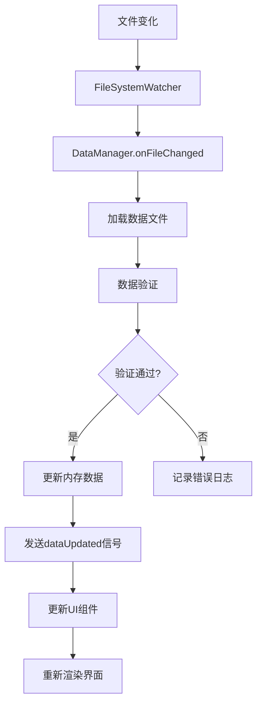

# RankingSystem 技术架构文档

## 系统概述

RankingSystem 是基于 Qt5/C++17 开发的跨平台编程竞赛排行榜系统，采用模块化设计，支持实时数据更新、多维度可视化和弹幕互动功能。

## 技术栈

### 核心技术

- **UI框架**：Qt 5.15+
- **图表库**：Qt Charts
- **构建系统**：CMake 3.16+
- **编程语言**：C++17
- **数据格式**：JSON
- **版本控制**：Git

### 开发环境

- **编译器**：
  - GCC 7+ (Linux)
  - Clang 8+ (macOS)
  - MSVC 2019+ (Windows)
- **IDE**：Qt Creator 推荐
- **包管理**：系统自带依赖管理

## 架构设计

### 总体架构

系统采用分层架构设计：

```
┌─────────────────────────────────────┐
│            Presentation Layer       │
│  ┌─────────────┬─────────────────┐  │
│  │ MainWindow  │   Widget Components │  │
│  └─────────────┴─────────────────┘  │
├─────────────────────────────────────┤
│            Business Layer           │
│  ┌─────────────┬─────────────────┐  │
│  │DataManager  │   Logic Controllers│  │
│  └─────────────┴─────────────────┘  │
├─────────────────────────────────────┤
│            Data Layer               │
│  ┌─────────────┬─────────────────┐  │
│  │ TeamData    │   File System    │  │
│  └─────────────┴─────────────────┘  │
└─────────────────────────────────────┘
```

### 设计模式

#### 1. MVC 模式

- **Model**：`TeamData`、`RankingModel` - 数据模型层
- **View**：`MainWindow`、各种Widget - 视图层  
- **Controller**：`DataManager` - 控制器层

#### 2. 观察者模式

用于数据更新通知：

```cpp
class DataManager : public QObject {
    Q_OBJECT
signals:
    void dataUpdated();
    void teamAdded(const TeamData& team);
    void teamUpdated(const TeamData& team);
};
```

#### 3. 工厂模式

用于组件创建：

```cpp
class WidgetFactory {
public:
    static QWidget* createChartWidget(ChartType type);
    static QWidget* createProblemWidget();
    static QWidget* createDanmakuWidget();
};
```

## 核心模块

### 1. 数据模型模块

#### TeamData 类

**职责：**
- 封装队伍数据结构
- 提供数据序列化/反序列化
- 计算统计信息
- 数据完整性校验

**核心接口：**

```cpp
class TeamData {
public:
    // 数据操作
    bool loadFromFile(const QString& filePath);
    bool saveToFile(const QString& filePath) const;
    void addSubmission(const Submission& submission);
    
    // 统计计算
    int solvedProblems() const;
    double accuracy() const;
    QDateTime lastSubmissionTime() const;
    
    // 数据校验
    QString calculateHash() const;
    bool verifyIntegrity() const;
    
    // 数据访问
    QString teamName() const { return m_teamName; }
    int totalScore() const { return m_totalScore; }
    QList<Submission> submissions() const { return m_submissions; }
    
private:
    QString m_teamName;
    int m_totalScore;
    QList<Submission> m_submissions;
    QDateTime m_lastSubmission;
};
```

#### RankingModel 类

**职责：**
- 管理排行榜数据显示
- 支持多种排序方式
- 提供数据模型接口

```cpp
class RankingModel : public QAbstractTableModel {
    Q_OBJECT
public:
    enum SortOrder {
        ByTotalScore,
        BySolvedProblems,
        ByAccuracy,
        ByLastSubmission
    };
    
    // QAbstractTableModel interface
    int rowCount(const QModelIndex& parent = QModelIndex()) const override;
    int columnCount(const QModelIndex& parent = QModelIndex()) const override;
    QVariant data(const QModelIndex& index, int role = Qt::DisplayRole) const override;
    QVariant headerData(int section, Qt::Orientation orientation, int role = Qt::DisplayRole) const override;
    
    // 排序功能
    void setSortOrder(SortOrder order);
    void updateData(const QList<TeamData>& teams);
    
private:
    QList<TeamData> m_teams;
    SortOrder m_sortOrder;
};
```

### 2. 数据管理模块

#### DataManager 类

**职责：**
- 统一数据管理入口
- 文件监控和自动更新
- 数据验证和错误处理

```cpp
class DataManager : public QObject {
    Q_OBJECT
public:
    explicit DataManager(QObject* parent = nullptr);
    
    // 数据加载
    bool loadData(const QString& dataDir);
    bool loadTeamData(const QString& filePath);
    
    // 自动更新
    void setAutoRefresh(bool enabled);
    void setRefreshInterval(int seconds);
    
    // 数据访问
    QList<TeamData> allTeams() const;
    TeamData teamByName(const QString& name) const;
    
signals:
    void dataUpdated();
    void loadingProgress(int percent);
    void errorOccurred(const QString& error);
    
private slots:
    void refreshData();
    void onFileChanged(const QString& path);
    
private:
    QList<TeamData> m_teams;
    QFileSystemWatcher* m_fileWatcher;
    QTimer* m_refreshTimer;
    QString m_dataDirectory;
};
```

### 3. 用户界面模块

#### MainWindow 类

**职责：**
- 主界面管理
- 组件协调
- 用户交互处理

```cpp
class MainWindow : public QMainWindow {
    Q_OBJECT
public:
    explicit MainWindow(QWidget* parent = nullptr);
    
private slots:
    void onRefreshClicked();
    void onAutoRefreshToggled(bool enabled);
    void onSortOrderChanged(int order);
    void onDataUpdated();
    
private:
    void setupUI();
    void setupMenuBar();
    void setupToolBar();
    void setupStatusBar();
    void connectSignals();
    
    // UI 组件
    QTableView* m_rankingTable;
    ChartWidget* m_chartWidget;
    ProblemWidget* m_problemWidget;
    DanmakuWidget* m_danmakuWidget;
    
    // 数据组件
    DataManager* m_dataManager;
    RankingModel* m_rankingModel;
};
```

### 4. 可视化模块

#### ChartWidget 类

**职责：**
- 数据图表展示
- 多种图表类型支持
- 实时数据更新

```cpp
class ChartWidget : public QWidget {
    Q_OBJECT
public:
    enum ChartType {
        BarChart,     // 柱状图
        LineChart,    // 折线图
        PieChart,     // 饼图
        ScatterChart  // 散点图
    };
    
    explicit ChartWidget(QWidget* parent = nullptr);
    
    void setChartType(ChartType type);
    void updateData(const QList<TeamData>& teams);
    
private:
    void createBarChart();
    void createLineChart();
    void createPieChart();
    void createScatterChart();
    
    QChartView* m_chartView;
    QChart* m_chart;
    ChartType m_currentType;
};
```

### 5. 弹幕模块

#### DanmakuWidget 类

**职责：**
- 弹幕显示和动画
- 内容过滤
- 用户交互

```cpp
class DanmakuWidget : public QWidget {
    Q_OBJECT
public:
    explicit DanmakuWidget(QWidget* parent = nullptr);
    
    void addDanmaku(const QString& text, const QColor& color = Qt::white);
    void setDanmakuSpeed(int speed);
    void setPaused(bool paused);
    
protected:
    void paintEvent(QPaintEvent* event) override;
    void timerEvent(QTimerEvent* event) override;
    
private:
    struct DanmakuItem {
        QString text;
        QColor color;
        int x, y;
        int speed;
        qint64 timestamp;
    };
    
    QList<DanmakuItem> m_danmakus;
    int m_timerId;
    int m_speed;
    bool m_paused;
};
```

## 数据流设计

### 数据更新流程



### 组件通信机制

系统采用信号-槽机制实现组件间通信：

```cpp
// 数据管理器连接
connect(m_dataManager, &DataManager::dataUpdated,
        this, &MainWindow::onDataUpdated);
connect(m_dataManager, &DataManager::errorOccurred,
        this, &MainWindow::showError);

// UI组件连接  
connect(m_refreshButton, &QPushButton::clicked,
        m_dataManager, &DataManager::refreshData);
connect(m_autoRefreshCheckBox, &QCheckBox::toggled,
        m_dataManager, &DataManager::setAutoRefresh);
```

## 性能优化

### 1. 内存管理

- **数据缓存**：使用 QCache 缓存频繁访问的数据
- **延迟加载**：大量数据分批加载
- **智能释放**：及时释放不用的资源

```cpp
class DataCache {
    QCache<QString, TeamData> m_teamCache;
    QCache<QString, QPixmap> m_iconCache;
    
public:
    TeamData* getTeam(const QString& name) {
        if (!m_teamCache.contains(name)) {
            m_teamCache.insert(name, loadTeamData(name));
        }
        return m_teamCache.object(name);
    }
};
```

### 2. 渲染优化

- **脏矩形更新**：只重绘变化区域
- **双缓冲**：避免界面闪烁
- **异步加载**：后台加载图表数据

```cpp
void ChartWidget::updateData(const QList<TeamData>& teams) {
    // 异步更新图表数据
    QtConcurrent::run([this, teams]() {
        auto* series = createSeriesData(teams);
        QMetaObject::invokeMethod(this, "updateSeries", 
                                  Qt::QueuedConnection,
                                  Q_ARG(QAbstractSeries*, series));
    });
}
```

### 3. 数据优化

- **增量更新**：只处理变化的数据
- **索引建立**：为查询建立索引
- **压缩存储**：压缩大数据文件

## 错误处理

### 错误分类

1. **数据错误**：文件格式错误、数据不完整
2. **网络错误**：API 请求失败、超时
3. **系统错误**：文件权限、内存不足
4. **用户错误**：无效输入、操作异常

### 错误处理策略

```cpp
class ErrorHandler {
public:
    enum ErrorLevel {
        Info,
        Warning,
        Error,
        Critical
    };
    
    static void handleError(ErrorLevel level, const QString& message) {
        switch (level) {
        case Info:
            qInfo() << message;
            break;
        case Warning:
            qWarning() << message;
            showWarningDialog(message);
            break;
        case Error:
            qCritical() << message;
            showErrorDialog(message);
            break;
        case Critical:
            qFatal("Critical error: %s", message.toLocal8Bit().data());
            break;
        }
    }
};
```

## 测试策略

### 单元测试

使用 Qt Test 框架进行单元测试：

```cpp
class TestTeamData : public QObject {
    Q_OBJECT
private slots:
    void testLoadFromFile();
    void testCalculateScore();
    void testDataIntegrity();
};

void TestTeamData::testLoadFromFile() {
    TeamData team;
    QVERIFY(team.loadFromFile("test_data.json"));
    QCOMPARE(team.teamName(), "Test Team");
    QCOMPARE(team.totalScore(), 100);
}
```

### 集成测试

- **数据流测试**：完整数据更新流程
- **UI交互测试**：用户操作响应
- **性能测试**：大数据量处理

### 自动化测试

```bash
#!/bin/bash
# 运行所有测试
mkdir -p build && cd build
cmake .. -DBUILD_TESTS=ON
make -j4
ctest --output-on-failure
```

## 部署架构

### 构建系统

```cmake
cmake_minimum_required(VERSION 3.16)
project(RankingSystem)

set(CMAKE_CXX_STANDARD 17)
set(CMAKE_CXX_STANDARD_REQUIRED ON)

find_package(Qt5 REQUIRED COMPONENTS Core Widgets Charts)

add_executable(RankingSystem
    src/main.cpp
    src/mainwindow.cpp
    src/teamdata.cpp
    src/datamanager.cpp
    src/chartwidget.cpp
    src/danmakuwidget.cpp
)

target_link_libraries(RankingSystem
    Qt5::Core
    Qt5::Widgets  
    Qt5::Charts
)
```

### 打包流程

1. **Windows**：使用 windeployqt 打包
2. **macOS**：使用 macdeployqt 和代码签名
3. **Linux**：使用 linuxdeployqt 创建 AppImage

## 扩展接口

### 插件系统

预留插件接口支持功能扩展：

```cpp
class IPlugin {
public:
    virtual ~IPlugin() = default;
    virtual QString name() const = 0;
    virtual QString version() const = 0;
    virtual bool initialize() = 0;
    virtual void cleanup() = 0;
};

class PluginManager {
public:
    bool loadPlugin(const QString& path);
    void unloadPlugin(const QString& name);
    QList<IPlugin*> availablePlugins() const;
};
```

### API 接口

```cpp
class APIInterface : public QObject {
    Q_OBJECT
public:
    virtual QList<TeamData> fetchTeams() = 0;
    virtual bool submitResult(const TeamData& team) = 0;
    
signals:
    void dataReceived(const QList<TeamData>& teams);
    void errorOccurred(const QString& error);
};
```

## 安全考虑

### 数据安全

- **输入验证**：严格验证所有输入数据
- **权限控制**：限制文件访问权限
- **数据加密**：敏感数据加密存储

### 系统安全

- **代码签名**：macOS/Windows 代码签名
- **沙盒运行**：限制系统资源访问
- **更新机制**：安全的自动更新

---

**文档版本：** v1.0  
**技术版本：** RankingSystem v1.0  
**最后更新：** 2025年6月30日  
**维护团队：** 开发组
