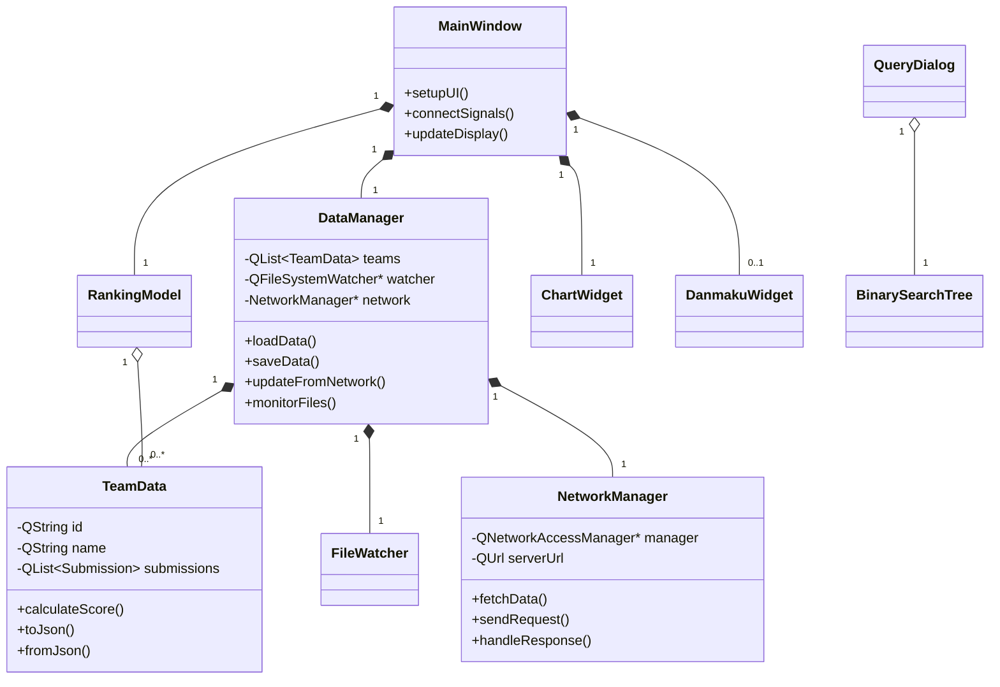
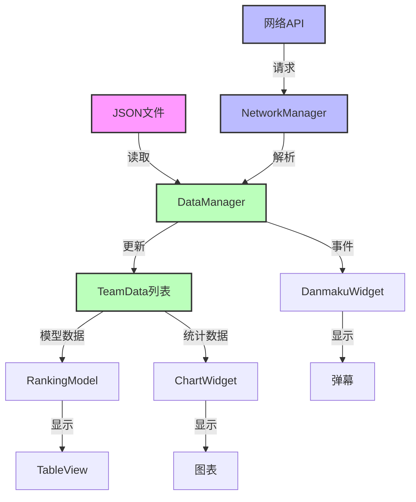

# RankingSystem 技术架构文档

## 系统概述

RankingSystem 是基于 Qt5/C++17 开发的跨平台编程竞赛排行榜系统，采用模块化设计，支持实时数据更新、多维度可视化、弹幕互动功能和网络数据获取。

## 技术栈

### 核心技术

- **UI框架**：Qt 5.15+
- **图表库**：Qt Charts
- **构建系统**：CMake 3.16+
- **编程语言**：C++17
- **数据格式**：JSON
- **网络库**：Qt Network
- **版本控制**：Git

### 开发环境

- **编译器**：
  - GCC 7+ (Linux)
  - Clang 8+ (macOS)
  - MSVC 2019+ (Windows)
- **IDE**：Qt Creator 推荐
- **包管理**：系统自带依赖管理

## 架构设计

### 总体架构

系统采用分层架构设计：

```
┌─────────────────────────────────────┐
│            Presentation Layer       │
│  ┌─────────────┬─────────────────┐  │
│  │ MainWindow  │   Widget Components │  │
│  └─────────────┴─────────────────┘  │
├─────────────────────────────────────┤
│            Business Layer           │
│  ┌─────────────┬─────────────────┐  │
│  │DataManager  │   Logic Controllers│  │
│  └─────────────┴─────────────────┘  │
├─────────────────────────────────────┤
│            Data Layer               │
│  ┌─────────────┬─────────────────┐  │
│  │ TeamData    │   File/Network IO   │  │
│  └─────────────┴─────────────────┘  │
└─────────────────────────────────────┘
```

### 模块组织

系统由以下主要模块组成：

1. **UI模块**：负责用户界面和交互
2. **数据管理模块**：负责数据处理和业务逻辑
3. **文件/网络模块**：负责文件读写和网络通信
4. **可视化模块**：负责图表和数据可视化
5. **弹幕模块**：负责弹幕显示和管理
6. **查询模块**：负责高级查询功能

### 类图



## 核心模块详解

### 1. UI模块

#### 1.1 MainWindow

主窗口类，负责整体UI布局和用户交互，包含：

- 菜单栏、工具栏和状态栏
- 排行榜表格视图
- 图表和可视化组件
- 弹幕显示区域
- 网络状态指示器

#### 1.2 Widget组件

- **ChartWidget**：负责各类统计图表显示
- **ProblemWidget**：显示题目状态和统计
- **DanmakuWidget**：弹幕显示和动画
- **StatusBar**：状态信息显示
- **NetworkConfigDialog**：网络连接配置界面

### 2. 数据管理模块

#### 2.1 DataManager

中央数据控制器，负责：

- 从文件/网络加载数据
- 监控文件变化
- 解析和验证JSON数据
- 生成TeamData对象
- 提供数据访问接口
- 管理数据源（本地/网络/混合）

#### 2.2 RankingModel

表格数据模型，负责：

- 实现Qt的Model/View架构
- 处理数据排序和筛选
- 提供表格单元格渲染
- 处理用户交互（如点击、选择）

### 3. 文件/网络模块

#### 3.1 FileWatcher

文件监控组件，基于`QFileSystemWatcher`：

- 实时监控数据文件变化
- 触发自动重新加载
- 处理文件访问错误

#### 3.2 NetworkManager

网络管理组件，负责：

- HTTP/HTTPS请求处理
- 自动重连机制
- 连接状态监控
- 数据解析和验证
- 支持多种认证方式
  - 无认证 - 开放的API接口
  - 基本认证 - 用户名/密码验证
  - API密钥 - Bearer Token认证
  - SSL/TLS - 安全传输层支持

#### 3.3 数据源管理

支持三种数据获取模式：
1. **本地文件模式** - 传统的本地JSON文件读取
2. **网络实时模式** - 从竞赛服务器实时获取数据
3. **混合模式** - 网络优先，本地备份的智能切换

### 4. 可视化模块

#### 4.1 ChartWidget

基于QtCharts的可视化组件：

- 队伍得分柱状图
- 题目提交饼图
- 提交时间趋势图
- 解题率统计图

#### 4.2 动画系统

- 排名变化动画
- 分数更新效果
- 图表过渡动画

### 5. 弹幕模块

#### 5.1 DanmakuWidget

基于Qt Graphics Framework：

- 弹幕渲染和动画
- 碰撞检测和布局
- 弹幕过滤和控制
- 自定义样式支持

#### 5.2 弹幕队列管理

- 高效的弹幕调度
- 优先级队列
- 内存管理优化

### 6. 查询模块

#### 6.1 二叉搜索树实现

用于高效查询和排序的数据结构：

- 模板化设计
- 自定义比较函数
- 多种遍历方式
- 范围查询支持

#### 6.2 QueryDialog

查询对话框，提供高级查询功能：

- 多种排序标准选择
- 前N名/后N名查询
- 分数范围查询
- 复合条件查询

## 网络功能实现状态

### 已完成功能

#### 核心网络组件
- **NetworkManager** - 网络管理器
  - HTTP/HTTPS请求处理
  - 自动重连机制
  - 连接状态监控
  - 数据解析和验证
  
- **NetworkConfigDialog** - 网络配置对话框
  - 服务器地址/端口配置
  - API端点设置
  - 认证方式选择
  - 连接测试功能

#### 数据管理增强
- **DataManager扩展**
  - 三种数据源支持：本地/网络/混合
  - 网络数据获取和缓存
  - 实时数据更新机制
  - 数据源智能切换

#### 用户界面集成
- **MainWindow增强**
  - 网络配置入口
  - 数据源切换控件
  - 网络状态指示器
  - 配置保存/加载

#### 测试和验证
- **测试服务器** (test_server.py)
  - 完整的REST API实现
  - 实时数据模拟
  - 多端点支持
  - CORS跨域支持

### 进行中功能

- **SSL/TLS验证** - 安全连接支持
- **数据压缩** - 减少网络传输大小
- **批量数据获取** - 优化大型比赛性能
- **增量更新** - 仅获取变更数据

### 已知问题

- 特定条件下自动重连可能失效
- 某些网络环境下延迟显著增加
- 大型比赛数据（>100队伍）可能导致UI卡顿

## 网络API参考

### 基本API端点

| 端点 | 方法 | 描述 |
|------|------|------|
| `/api/contest/data` | GET | 获取完整比赛数据 |
| `/api/teams` | GET | 获取所有队伍信息 |
| `/api/problems` | GET | 获取题目列表 |
| `/api/submissions` | GET | 获取提交记录 |
| `/api/scoreboard` | GET | 获取排行榜数据 |

### 响应示例

```json
{
  "contest": {
    "id": "icpc-2025",
    "name": "ICPC World Finals 2025",
    "start_time": "2025-07-01T10:00:00Z",
    "duration": 18000
  },
  "teams": [
    {
      "id": "team01",
      "name": "Coding Masters",
      "university": "Tech University"
    },
    // ...更多队伍
  ],
  "submissions": [
    {
      "id": "sub001",
      "team_id": "team01",
      "problem_id": "A",
      "time": "2025-07-01T10:30:45Z",
      "result": "AC",
      "language": "C++"
    },
    // ...更多提交
  ]
}
```

## 数据流图



## 网络连接和配置指南

### 启动测试服务器

```bash
# 在项目根目录下
cd scripts
python3 test_server.py

# 自定义端口
python3 test_server.py 9090
```

### 配置网络连接

1. 打开主界面后，点击菜单 `设置` → `网络配置`
2. 在弹出的对话框中配置以下内容：

```
服务器地址: localhost (或远程服务器IP)
端口: 8080 (或自定义端口)
API路径: /api/contest/data
认证类型: 无认证 (或根据服务器要求选择)
```

### 数据刷新间隔

可在设置中调整网络数据刷新间隔（默认为5秒）：

```
最小: 1秒 (高负载，实时性最高)
建议: 5秒 (平衡实时性和服务器负载)
最大: 60秒 (低负载，实时性较低)
```

## 性能优化

### 渲染优化

- 表格视图虚拟化
- 图表懒加载
- 弹幕碰撞优化
- 网络请求批处理

### 内存优化

- 弱引用缓存
- 数据压缩传输
- 按需加载资源

## 安全措施

- 数据验证和清理
- HTTPS加密连接
- API访问控制
- 输入验证
- 错误日志加密

## 扩展性设计

### 插件系统

- 自定义数据源
- 自定义图表
- 事件钩子

### 主题支持

- 动态样式切换
- 高对比度模式
- 深色/浅色主题

## 错误处理与日志

### 日志级别

- DEBUG：详细调试信息
- INFO：常规操作信息
- WARNING：潜在问题警告
- ERROR：运行时错误
- CRITICAL：严重错误

### 故障恢复

- 自动重连机制
- 数据备份和恢复
- 崩溃转储分析

## 开发者接口

### 扩展点

- 自定义数据解析器
- 自定义排序算法
- 自定义可视化组件
- 自定义网络协议

### 添加新的数据源

在 `networkmanager.h` 中扩展 `DataSourceType` 枚举：

```cpp
enum class DataSourceType {
    LocalFile,
    NetworkHttp,
    NetworkCustom,  // 添加新类型
    Mixed
};
```

并在 `NetworkManager` 类中实现对应的数据获取方法：

```cpp
void NetworkManager::fetchFromCustomSource() {
    // 自定义数据源的实现
}
```
