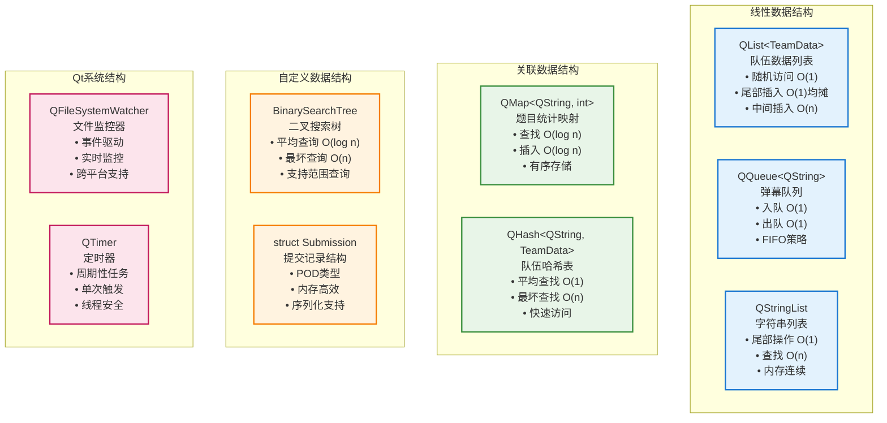
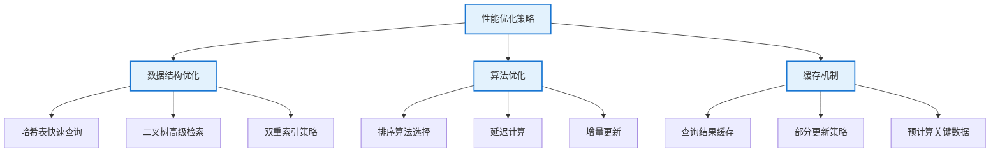

# RankFlow 数据结构与算法设计

## 1. 主要数据结构设计

### 1.1 核心数据结构概览



### 1.2 数据结构分类

| 类别 | 数据结构 | 用途 | 文件位置 |
|-----|---------|------|---------|
| **线性结构** | `QList<T>` | 存储队伍列表、提交记录等 | 多个文件 |
| **关联结构** | `QMap<QString, int>` | 题目统计映射 | chartwidget.cpp |
| **字符串结构** | `QStringList` | 存储字符串列表 | 多个文件 |
| **自定义结构** | `struct Submission` | 提交记录结构体 | teamdata.h |
| **时间结构** | `QDateTime` | 时间戳存储 | 多个文件 |
| **二叉树结构** | `BinarySearchTree<T>` | 高效查询与排序 | binarysearchtree.h |

## 2. 核心数据结构详解

### 2.1 Submission 结构体

```cpp
struct Submission {
    QString problemId;      // 题目ID
    QDateTime timestamp;    // 提交时间戳
    bool isCorrect;        // 是否正确
    int runTime;           // 运行时间(ms)
    int memoryUsage;       // 内存使用(bytes)
    
    Submission() : isCorrect(false), runTime(0), memoryUsage(0) {}
    
    QJsonObject toJson() const;
    void fromJson(const QJsonObject &json);
};
```

**设计特点：**
- ✅ **轻量级结构**：使用简单的POD类型
- ✅ **序列化支持**：提供JSON转换方法
- ✅ **默认构造**：安全的默认值初始化

### 2.2 TeamData 类数据结构

```cpp
class TeamData {
private:
    QString m_id;                            // 队伍ID
    QString m_name;                          // 队伍名称
    QList<Submission> m_submissions;         // 提交历史
    QMap<QString, int> m_problemAttempts;    // 每题尝试次数
    QMap<QString, bool> m_problemSolved;     // 题目是否解决
    QMap<QString, int> m_problemScores;      // 每题得分
    QMap<QString, QDateTime> m_solveTime;    // 解题时间
    int m_totalScore;                        // 总分
    
    // ...其他成员
};
```

**设计特点：**
- ✅ **封装性**：私有数据与公共接口分离
- ✅ **高效查询**：使用映射加速题目状态查询
- ✅ **全面统计**：维护多种状态和统计信息

### 2.3 DataManager 类数据结构

```cpp
class DataManager : public QObject {
private:
    QList<TeamData> m_teamData;                    // 队伍数据列表
    QHash<QString, TeamData*> m_teamLookup;        // 队伍快速查找
    QFileSystemWatcher* m_fileWatcher;             // 文件监控器
    QString m_dataPath;                            // 数据文件路径
    QTimer* m_updateTimer;                         // 更新定时器
    BinarySearchTree<TeamData>* m_searchTree;      // 查询二叉树
    
    // ...其他成员
};
```

**设计特点：**
- ✅ **双重索引**：列表+哈希表提高访问效率
- ✅ **实时监控**：自动检测数据文件变化
- ✅ **高级查询**：二叉树支持复杂查询操作

### 2.4 二叉搜索树数据结构

```cpp
template<typename T>
class BinarySearchTree {
private:
    struct Node {
        T data;
        Node* left;
        Node* right;
        Node(const T& value) : data(value), left(nullptr), right(nullptr) {}
    };
    
    Node* m_root;
    CompareFunc m_compare;
    
    // ...私有辅助方法
    
public:
    // 基本操作和高级查询功能
    // ...
};
```

**设计特点：**
- ✅ **模板设计**：支持任意类型数据
- ✅ **自定义比较**：灵活的排序标准
- ✅ **范围查询**：支持区间和Top-N查询

## 3. 算法设计与性能分析

### 3.1 排名算法

```cpp
// 基于总分和解题数的排名计算
void RankingModel::calculateRanks() {
    // 1. 按总分排序
    std::sort(m_teamList.begin(), m_teamList.end(), 
        [](const TeamData& a, const TeamData& b) {
            if (a.totalScore() != b.totalScore())
                return a.totalScore() > b.totalScore();
            
            // 2. 总分相同按解题数排序
            int aSolved = a.solvedCount();
            int bSolved = b.solvedCount();
            if (aSolved != bSolved)
                return aSolved > bSolved;
            
            // 3. 解题数相同按最后提交时间排序
            return a.lastSubmissionTime() < b.lastSubmissionTime();
        });
    
    // 更新排名
    for (int i = 0; i < m_teamList.size(); i++) {
        m_teamList[i].setRank(i + 1);
    }
}
```

**算法复杂度**：O(n log n)，其中n为队伍数量

### 3.2 二叉树查询算法

```cpp
// 范围查询实现
template<typename T>
QList<T> BinarySearchTree<T>::rangeQuery(const T& min, const T& max) {
    QList<T> result;
    rangeQueryHelper(m_root, min, max, result);
    return result;
}

// 辅助函数
template<typename T>
void BinarySearchTree<T>::rangeQueryHelper(Node* node, const T& min, const T& max, QList<T>& result) {
    if (node == nullptr)
        return;
    
    // 递归左子树
    if (m_compare(min, node->data))
        rangeQueryHelper(node->left, min, max, result);
    
    // 检查当前节点是否在范围内
    if (!m_compare(min, node->data) && !m_compare(node->data, max))
        result.append(node->data);
    
    // 递归右子树
    if (m_compare(node->data, max))
        rangeQueryHelper(node->right, min, max, result);
}
```

**算法复杂度**：O(k + log n)，其中k是结果集大小，n是树中节点数量

### 3.3 优化策略



## 4. 数据结构选择依据

### 4.1 线性结构选择

- **QList vs std::vector**：QList在Qt环境中有更好的集成性，且API设计更符合项目风格
- **QList vs QVector**：QList在中小型数据集上内存分配更灵活，适合频繁添加/删除元素的场景
- **QQueue vs std::queue**：QQueue提供了更丰富的Qt信号槽集成能力

### 4.2 关联容器选择

- **QHash vs QMap**：QHash提供平均O(1)的查找性能，适合频繁查询的场景
- **QMap vs std::map**：QMap提供了Qt特有的便捷方法，与项目其他Qt组件协作更好
- **红黑树 vs 哈希表**：对于需要排序的场景使用QMap，对于纯查询场景使用QHash

### 4.3 自定义数据结构

- **二叉搜索树**：自定义实现提供了特定于应用的查询操作，如范围查询和Top-N查询
- **结构体vs类**：对于简单的数据结构使用struct，对于需要封装行为的使用class
- **继承vs组合**：优先使用组合而非继承，降低耦合度

## 5. 总结与最佳实践

- ✅ **数据封装**: 所有核心数据结构严格封装，提供清晰的公共接口
- ✅ **高效查询**: 使用哈希表和二叉树提供O(1)或O(log n)的查询性能
- ✅ **内存优化**: 避免不必要的数据复制，使用引用和指针传递大型对象
- ✅ **扩展性**: 模块化设计和松耦合结构，便于未来功能扩展
- ✅ **类型安全**: 使用模板和强类型设计，避免运行时类型错误
- ✅ **一致性**: 遵循Qt设计风格，与框架无缝集成
