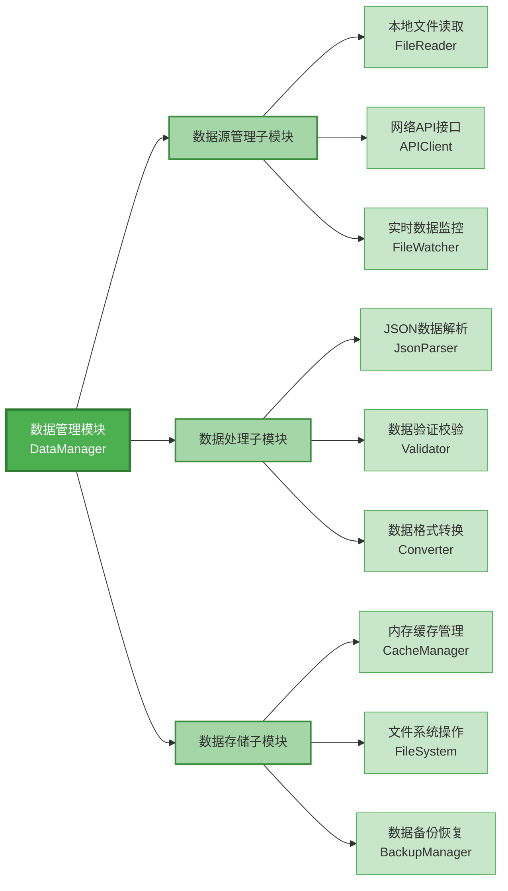
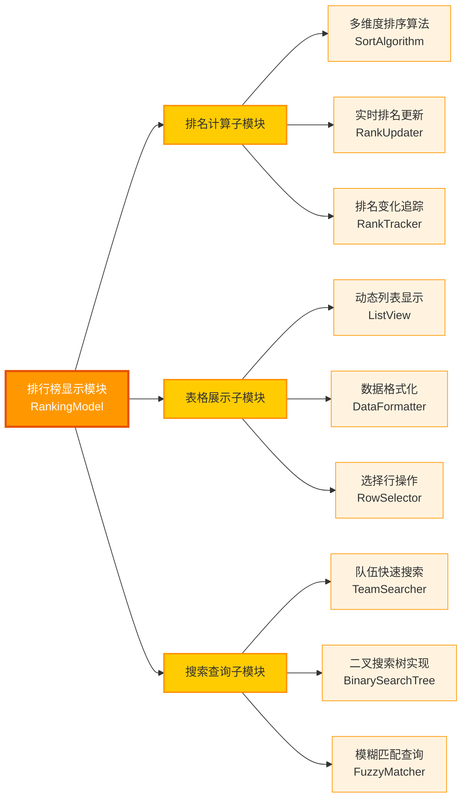
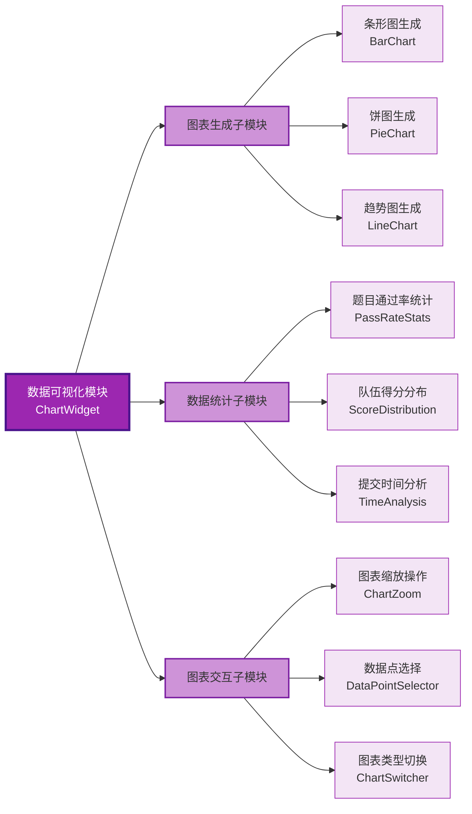
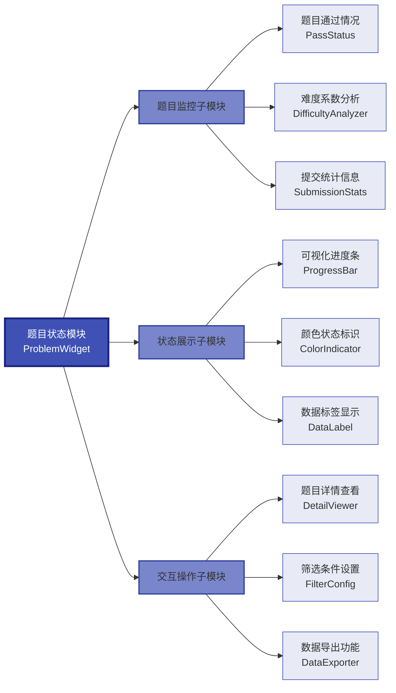
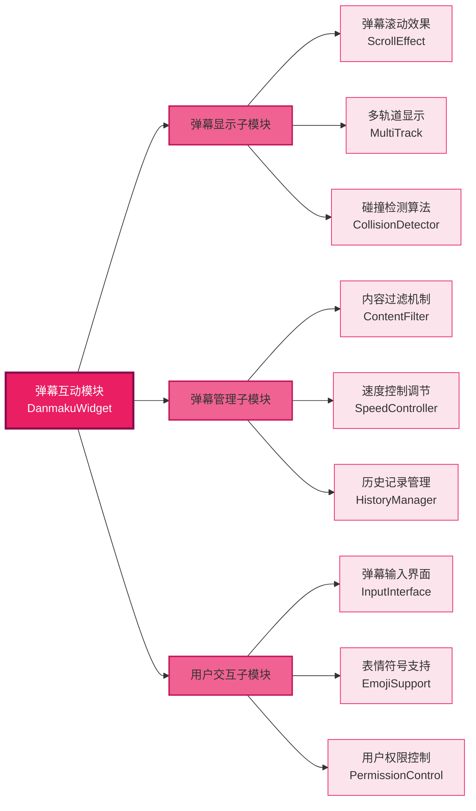
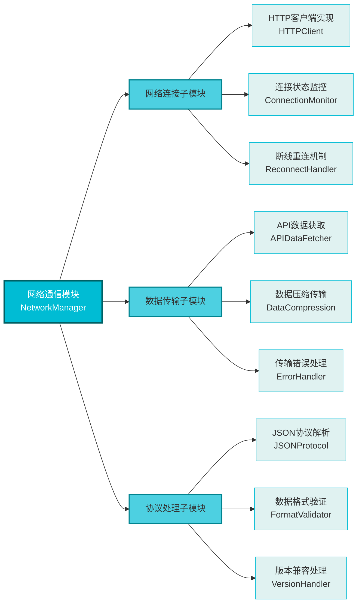
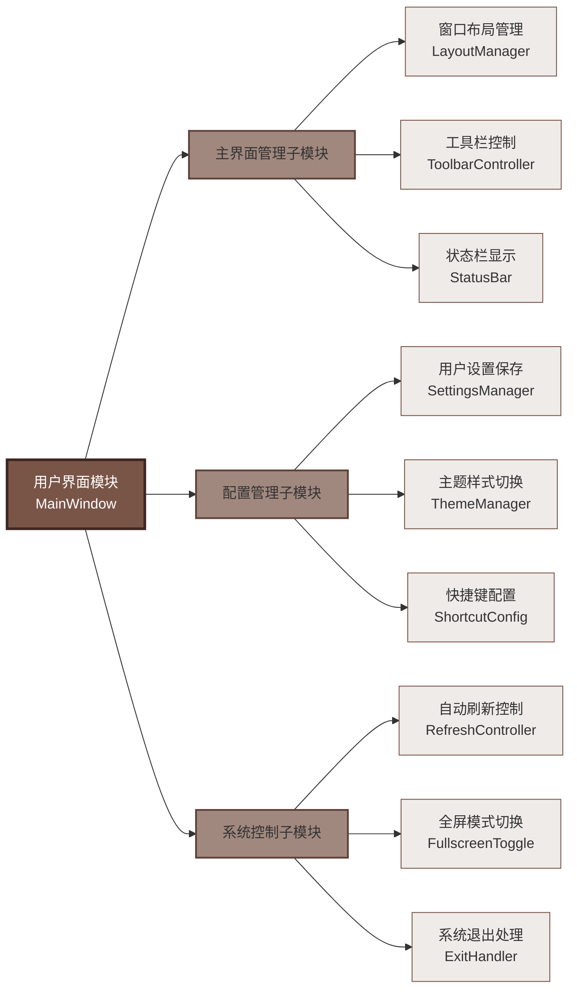
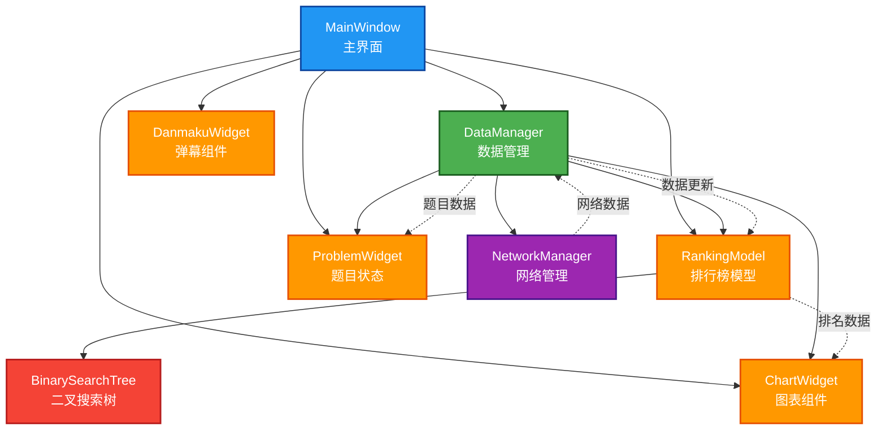
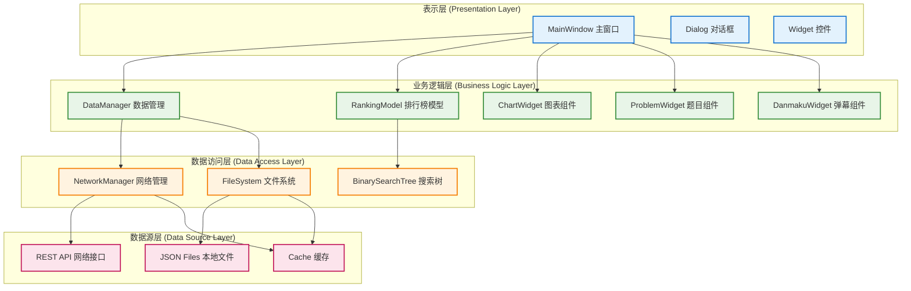

# RankFlow 排行榜系统功能模块图

## 1. 系统总体功能模块图

```mermaid
graph TB
    A[RankFlow排行榜系统] --> B[数据管理模块<br/>DataManager]
    A --> C[排行榜显示模块<br/>RankingModel]
    A --> D[数据可视化模块<br/>ChartWidget]
    A --> E[题目状态模块<br/>ProblemWidget]
    A --> F[弹幕互动模块<br/>DanmakuWidget]
    A --> G[网络通信模块<br/>NetworkManager]
    A --> H[用户界面模块<br/>MainWindow]
    
    B --> B1[数据源管理]
    B --> B2[数据处理]
    B --> B3[数据存储]
    
    C --> C1[排名计算]
    C --> C2[表格展示]
    C --> C3[搜索查询]
    
    D --> D1[图表生成]
    D --> D2[数据统计]
    D --> D3[图表交互]
    
    E --> E1[题目监控]
    E --> E2[状态展示]
    E --> E3[交互操作]
    
    F --> F1[弹幕显示]
    F --> F2[弹幕管理]
    F --> F3[用户交互]
    
    G --> G1[网络连接]
    G --> G2[数据传输]
    G --> G3[协议处理]
    
    H --> H1[主界面管理]
    H --> H2[配置管理]
    H --> H3[系统控制]
    
    classDef moduleClass fill:#e1f5fe,stroke:#01579b,stroke-width:2px
    classDef subModuleClass fill:#f3e5f5,stroke:#4a148c,stroke-width:1px
    
    class A moduleClass
    class B,C,D,E,F,G,H moduleClass
    class B1,B2,B3,C1,C2,C3,D1,D2,D3,E1,E2,E3,F1,F2,F3,G1,G2,G3,H1,H2,H3 subModuleClass
```

## 2. 数据管理模块详细图

## 3. 排行榜显示模块详细图

## 4. 数据可视化模块详细图

## 5. 题目状态模块详细图

## 6. 弹幕互动模块详细图

## 7. 网络通信模块详细图

## 8. 用户界面模块详细图

## 9. 模块间交互关系图

## 10. 系统架构层次图

